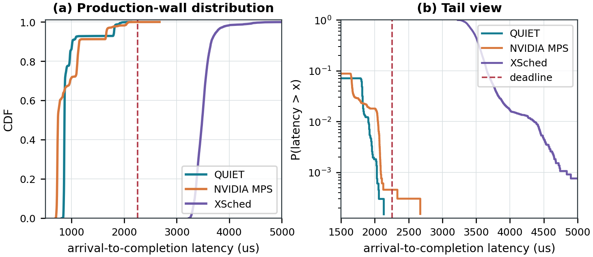
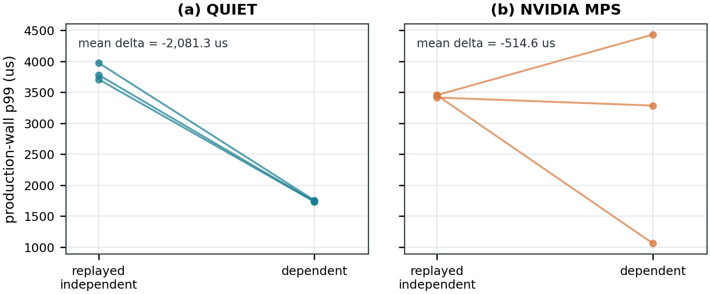
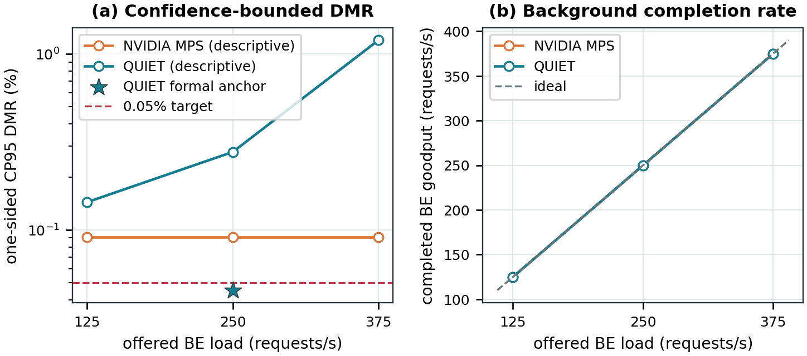
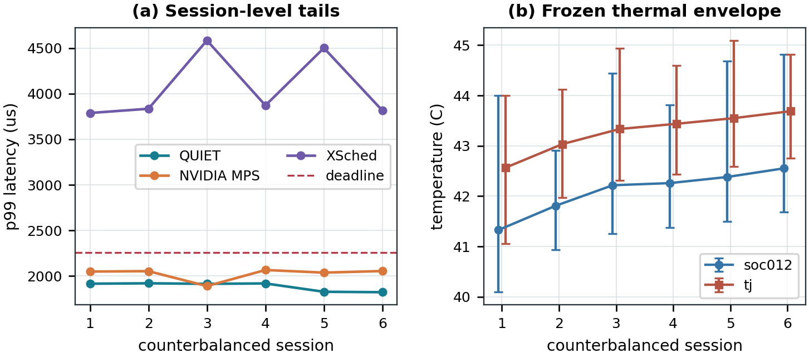

# QUIET on Jetson AGX Thor

QUIET is a dependency-aware runtime for two-stage TensorRT inference across
isolated edge-GPU partitions. It carries a complete intermediate activation
between separate Thor MIG CUDA contexts through registered coherent system
memory, protects the producer from best-effort interference, and returns that
capacity immediately after publication while the consumer executes.

The implementation treats the activation edge, publication event, and
remaining end-to-end slack as one scheduling contract. It does not modify
TensorRT engines, CUDA kernels, or the NVIDIA driver.

<p align="center">
  
</p>

## Results at a glance

### All locally executed comparison systems

Every vendor control and published-system implementation that actually ran on
Thor appears in this first table. A different workload, deadline, or fidelity
gate changes how a row may be used; it does not remove the measured row.

- **A — formal common contract:** directly comparable six-session ImageNette
  rows.
- **B — separate numeric contract:** a real application/runtime result whose
  deadline, repetition, or fidelity lock differs.
- **C — historical numeric contract:** raw-replayed data from the superseded
  Whisper campaign.
- **D — executed mechanism boundary:** the original planner, scheduler, or
  data-plane mechanism ran, but could not produce a common end-to-end row.

| System | What actually ran | Recorded result | Evidence use |
|---|---|---|---|
| **QUIET** | Current thermal ImageNette campaign; earlier balanced Whisper campaign | Current: 0/6,600 misses, CP95 DMR 0.0454%, p99 1,902.987 us, BE 249.909 requests/s. Earlier: 0/9,000 misses, p99 1,578.293 us, BE 499.943 requests/s | **A**; earlier control is C |
| NVIDIA MPS | Current thermal ImageNette campaign; earlier balanced Whisper campaign | Current: 2/6,600 misses, CP95 DMR 0.0954%, p99 2,045.606 us, BE 249.941 requests/s. Earlier: 8,950/9,000 misses, p99 2,180.974 us, BE 499.969 requests/s | **A**; earlier control is C |
| [XSched](baselines/xsched/) (OSDI 2025) | Pinned native XQueue path in the current thermal ImageNette campaign | 6,600/6,600 misses, p99 4,351.332 us, accuracy 0.8345, BE 97.845 requests/s | **A**; directly comparable and SLO-infeasible |
| [Pantheon](baselines/pantheon/) (MobiSys 2024) | Pinned native runtime on the 90-input ImageNette gate at its integer 2,224-us deadline | Accuracy 0.8333, 2/90 misses, p99 4,133 us, BE 249.785 requests/s | **B**; native numeric result, not pooled with A |
| [Orion](baselines/orion/) (EuroSys 2024) | Managed Thor execution on the 90-input ImageNette gate; earlier six-sequence full-DAG run | Current gate: accuracy 0.8333, 0/90 misses at D=5,722.576 us, p99 5,537.090 us. Earlier: 0/9,000 misses, p99 1,569.738 us, BE 153.571 requests/s | **B + C**; numeric results shown, differential-decision fidelity gate still open |
| [BLESS](baselines/bless/) (EuroSys 2025) | Scheduler and estimators, 2/4/6/8-SM contexts, 9,400 traced launches, q25 held-out switching, and exact-q100 compatibility test | q25 output and switch gate pass; exact q100 plan fails inside Myelin in the required 2-SM context | **D**; measured compatibility failure, not omitted |
| NVIDIA MIG | Physical-isolation treatment in the earlier balanced Whisper campaign | 8,424/9,000 misses, CP95 DMR 94.0194%, p99 2,215.748 us, BE 499.963 requests/s | **C**; historical capacity/isolation control |
| [GSLICE](baselines/gslice/) (SoCC 2020) | Quota-selection port in the earlier balanced Whisper campaign | 9,000/9,000 misses, p99 2,094.460 us, BE 499.955 requests/s | **C**; historical numeric port result |
| [gpulet](baselines/gpulet/) (USENIX ATC 2022) | Native planner over all five representable partitions plus diagnostic execution | Planner finds no feasible dependent plan; diagnostic has 9,000/9,000 misses, p99 2,099.367 us, BE 499.959 requests/s | **C + D**; planner failure and diagnostic number both shown |
| [BOER](baselines/boer/) (SC 2025) | Pinned optimizer on independent services and the dependent DAG | Independent worst p99 1.481 ms at 499.78/499.63 requests/s; dependent best p99 2.058 ms with 100% DMR and no feasible point | **D**; numeric positive control plus measured dependent failure |
| [ParvaGPU](baselines/parvagpu/) (SC 2024) | Pinned segment allocator on independent services and the dependent DAG | Independent p99 0.434/0.969 ms at 499.89/499.76 requests/s; dependent producer rejected by admission | **D**; numeric positive control plus measured allocation failure |
| [DeepPlan](baselines/deepplan/) (EuroSys 2023) | Pinned plan-selection rule on the 2.304-MB Thor transport profile | Dynamic plan selects direct host access: 14.058-us p99 versus 114.041 us for pinned load/copy | **D**; measured data-plane result, no dependency scheduler |

Only the three **A** rows are a same-condition ranking. Rows B--D remain in
the result table because they were executed; their evidence class limits the
claim instead of hiding the data. The C rows use a 2.304-MB Whisper edge, a
1,701.316-us deadline, six Williams sequences, and no thermal normalization.

### Directly comparable formal campaign

The promoted experiment uses a fixed 1g-producer/2g-consumer placement, a
802,816-byte ResNet-50 activation, open-loop DistilBERT best-effort pressure,
and a frozen 2,255.483-us arrival-to-completion deadline. Each system executes
1,100 measured requests in each of six counterbalanced sessions.

| System | Requests | Misses | Observed DMR | one-sided CP95 DMR | p50 (us) | p99 (us) | p99.9 (us) | BE requests/s |
|---|---:|---:|---:|---:|---:|---:|---:|---:|
| **QUIET** | 6,600 | **0** | **0.0000%** | **0.0454%** | 863.886 | **1,902.987** | **2,025.643** | 249.909 |
| NVIDIA MPS | 6,600 | 2 | 0.0303% | 0.0954% | **739.887** | 2,045.606 | 2,086.694 | **249.941** |
| XSched (native Thor port) | 6,600 | 6,600 | 100.0000% | 100.0000% | 3,484.202 | 4,351.332 | 4,741.721 | 97.845 |

QUIET is the only row whose exact confidence bound qualifies for the frozen
0.05% DMR target. Across the six paired sessions, QUIET reduces p99 relative
to MPS by 138.508 us, with a 95% interval of [-233.217, -43.798] us. The
paired background-goodput effect is -0.0317 requests/s with an interval of
[-0.0988, 0.0354], so the supported claim is lower tail latency at
statistically unresolved goodput difference, not a throughput win.

<p align="center">
  
</p>

### Application-semantic gates

| Workload | Measured inputs | Reference | Candidate | Delta | Promotion scope |
|---|---:|---:|---:|---:|---|
| ImageNette / ResNet-50 | 90 | 0.8333 accuracy | 0.8333 accuracy | 0.0000 | Labelled split-DAG gate passed |
| LibriSpeech / Whisper-Tiny | 10 | 0.9000 exact match | 0.9000 exact match | 0.0000 | Byte-identical output traces |
| LibriSpeech / Whisper-Tiny | 10 | 0.1127 WER | 0.1127 WER | 0.0000 | Below frozen 0.20 maximum |
| Formal ImageNette campaign | 6,600/system | 0.8345 accuracy | 0.8345 for every system | 0.0000 | Bound to every formal session |

## Systems without a published-system numeric run

The systems below are excluded from the numeric result table for the reason
the user identified: the published runtime could not be executed on this
stack, or its design changes the workload/control boundary. A local heuristic
is not reported under a paper's name.

| System | Why no published-system numeric run |
|---|---|
| [Mudi](https://chenwenyan.github.io/assets/pdf/mudi.pdf) (EuroSys 2025) | Cluster inference/training scaling has a different objective, and no public artifact exposes the required Thor dependency interface |
| [MIGER](https://doi.org/10.1145/3673038.3673089) (ICPP 2024) | Joint cluster-level MIG+MPS allocation has no request-specific activation-edge or Thor adapter |
| [FluidFaaS](https://research.csc.ncsu.edu/picture/publications/papers/hpdc2025.pdf) (HPDC 2025) | The A100 serverless runtime was not executed; only the host-memory materialize/copy concept is measured in the transport control below |
| [REEF](https://www.usenix.org/conference/osdi22/presentation/han) (OSDI 2022) | Its reset/preemption path targets a different runtime/backend and cannot control the closed TensorRT path |
| [Miriam](https://doi.org/10.1145/3625687.3625789) (SenSys 2023) | Requires generated elastic CUDA kernels rather than locked opaque TensorRT plans |
| [HaX-CoNN](https://doi.org/10.1145/3627535.3638502) (PPoPP 2024) | Per-layer heterogeneous mapping requires a usable equivalent DLA execution path unavailable to this workload |
| [EdgeIso](https://doi.org/10.1109/IPDPS47924.2020.00039) (IPDPS 2020) | CPU/GPU shared-resource and DVFS isolation operates at a different control boundary |
| [DARIS](https://arxiv.org/abs/2504.08795) (2025 preprint) | Requires a modified LibTorch segmented path, changing the locked runtime semantics |
| [EdgeServing](https://arxiv.org/abs/2605.05527) (2026 preprint) | Batching and early exits change model execution and require a separate accuracy-equivalent adapter |
| [Ev-Edge](https://arxiv.org/abs/2403.15717) (2024 preprint) | Uses event-camera workloads and a Xavier-specific runtime rather than the Thor TensorRT dependency contract |
| [GCAPS](https://arxiv.org/abs/2406.05221) (2024 preprint) | Requires driver and task-segment instrumentation unavailable in the current stack |
| [GPreempt](https://www.usenix.org/conference/atc25/presentation/fan) (USENIX ATC 2025) | Requires runtime/kernel timeslice yield outside the unmodified TensorRT boundary |
| [Edge-GPU process isolation study](https://arxiv.org/abs/2601.07600) (2026 preprint) | A characterization study rather than an executable dependency scheduler |

The full design-space audit is in [`docs/sota-matrix.md`](docs/sota-matrix.md),
the historical-campaign audit is in
[`docs/p9-sota-reselection.md`](docs/p9-sota-reselection.md), and the current
claim boundary is in [`docs/p9-current-status.md`](docs/p9-current-status.md).

## Additional measured results

### Same-activation causal replay

The independent and dependent arms use the same pre-captured activation bytes,
models, request IDs, placement, arrivals, pressure, and output oracle. Only
precedence changes. Each point below is a 20-request arm; the interval uses
three sequential session pairs and is exploratory rather than thermal formal
evidence.

| System | Mean dependent - independent p99 | 95% paired-session interval | Interpretation |
|---|---:|---:|---|
| **QUIET** | **-2,081.286 us** | **[-2,394.953, -1,767.619] us** | Dependency selects a lower-contention schedule in all three pairs |
| NVIDIA MPS | -514.579 us | [-4,779.753, 3,750.595] us | Direction is unresolved and varies across pairs |

<p align="center">
  
</p>

### Transport control

The 20-request learned ResNet10 control carries the same 1,884,160-byte tensor
and emits the same output trace for every transport. It rejects the assumption
that registered direct binding is universally fastest; QUIET profiles the
joint stage/edge tail instead of assuming a copy constant.

| Transport | Edge p99 (us) | Production-wall p99 (us) | Scope |
|---|---:|---:|---|
| Registered coherent system memory, direct TensorRT binding | 2,195.508 | 2,908.268 | Current QUIET data path |
| Pinned D2H/H2D bounce | **1,863.770** | **2,538.617** | Explicit-copy control |
| Pageable bounce | 2,283.200 | 2,975.838 | Explicit-copy control |

These short nonthermal measurements characterize the mechanism; they are not
a universal transport ranking.

### Offered-load frontier

Each hollow point contains three sessions and 3,300 requests. The points are
descriptive because they are not thermal normalized and cannot by themselves
certify a 0.05% DMR target. The formal QUIET anchor is a separate six-session
point.

| System | Offered BE requests/s | Requests | Misses | CP95 DMR | p99 (us) | Completed BE requests/s |
|---|---:|---:|---:|---:|---:|---:|
| NVIDIA MPS | 125 | 3,300 | 0 | 0.0907% | 1,940.769 | 124.950 |
| NVIDIA MPS | 250 | 3,300 | 0 | 0.0907% | 1,990.308 | 249.888 |
| NVIDIA MPS | 375 | 3,300 | 0 | 0.0907% | 2,052.077 | 374.868 |
| QUIET | 125 | 3,300 | 1 | 0.1437% | 1,851.749 | 124.941 |
| QUIET | 250 | 3,300 | 4 | 0.2772% | 1,912.867 | 249.908 |
| QUIET | 375 | 3,300 | 29 | 1.1963% | 2,240.971 | 374.897 |
| **QUIET formal anchor** | 250 | 6,600 | **0** | **0.0454%** | **1,902.987** | 249.909 |

<p align="center">
  
</p>

### Session and thermal stability

All six formal sessions pass the frozen thermal gate. Each has 430--434
telemetry samples and the required VDD_GPU rail; the largest within-session
`soc012` range is 3.907 °C, the largest `tj` range is 2.938 °C, and the largest
cross-session mean drift is 0.910 °C. Temperature admits or rejects a session;
it is not used to rescale latency.

<p align="center">
  
</p>

## Runtime boundary

QUIET begins protection before producer release and ends it immediately after
payload publication/visibility. Best-effort work resumes while the consumer
runs. Production-wall latency ends at consumer completion; checksums and
output validation happen afterward.

<p align="center">
  
</p>

These six embedded images are all figures used by the current manuscript. PDF
and PNG versions, generated tables, and their SHA-256 provenance are under
[`paper/eurosys27/`](paper/eurosys27/).

## Repository layout

```text
.
├── analysis/       Evidence replay, statistics, audits, and paper generation
├── baselines/      Nine published-system ports/adapters and fidelity checks
├── benchmarks/     C++/CUDA microbenchmarks and TensorRT pipeline binaries
├── configs/        Sanitized configuration examples
├── docs/           Platform notes, contracts, runbooks, and comparison scope
├── include/        Shared C++ headers
├── models/         Download manifest and public label/class metadata
├── paper/eurosys27 Current LaTeX source, all figures, tables, provenance, PDF
├── runtime/        QUIET controllers, telemetry, and aggregation logic
├── scripts/        Model preparation and experiment orchestration
├── src/            Platform probe implementation
└── tests/          Python, shell-contract, and C++ unit tests
```

Build products, virtual environments, downloaded models, TensorRT engines,
machine-local MIG state, and raw experiment directories are intentionally not
tracked. This keeps the public repository source-oriented while preserving the
34-GB measurement corpus on the experiment host.

## Build and test

The native runtime requires Jetson Linux R39.2, CUDA 13.2, TensorRT 10.16.2,
CMake 3.25 or newer, Ninja, and a C++20 compiler.

```bash
cmake -S . -B build-r39 -G Ninja \
  -DCMAKE_BUILD_TYPE=Release \
  -DCMAKE_CUDA_COMPILER=/usr/local/cuda-13.2/bin/nvcc \
  -DCMAKE_CUDA_ARCHITECTURES=110
cmake --build build-r39 --parallel
ctest --test-dir build-r39 --output-on-failure
```

Project targets compile with strict host warnings, including `-Wall`,
`-Wextra`, `-Wpedantic`, and `-Werror` where applicable. The analysis and test
tools use Python 3 together with NumPy, SciPy, Matplotlib, Pillow, ONNX/ONNX
Runtime, PyTorch, and OpenCV for the relevant application preparation paths.

```bash
python3 -m pytest -q
```

## Platform configuration

`scripts/configure_thor_mig.sh` creates the fixed 1g+2g layout and writes a
machine-local environment file. The variable schema is shown in
[`configs/mig.env.example`](configs/mig.env.example); real UUIDs are never
committed.

Experiment runners validate MIG UUIDs, model and input hashes, operational
release traces, thermal sensors, and runtime binaries before admitting a run.
System-level scripts may stop the display manager, pin clocks, or manage a
private MPS daemon and therefore require appropriate local privileges.

## Paper and figure reproduction

The current manuscript entry point is
[`paper/eurosys27/p9-main.tex`](paper/eurosys27/p9-main.tex), and the compiled
ten-page paper is [`paper/eurosys27/p9-main.pdf`](paper/eurosys27/p9-main.pdf).

```bash
cd paper/eurosys27
pdflatex -interaction=nonstopmode -halt-on-error p9-main.tex
bibtex p9-main
pdflatex -interaction=nonstopmode -halt-on-error p9-main.tex
pdflatex -interaction=nonstopmode -halt-on-error p9-main.tex
```

On the measurement host, the current figures and tables can be regenerated
from the bound raw corpus with:

```bash
python3 analysis/generate_p9_current_figures.py
```

The generator fails closed on input SHA-256, request count, deadline,
application gate, thermal gate, miss count, or replayed-p99 mismatch.

## Evidence policy and scope

- `results/` is the local raw evidence store and is excluded from Git because
  it is approximately 30 GB.
- `models/cache/` and `models/engines/` are reproducible downloads/builds and
  are excluded because they are approximately 4 GB.
- `models/manifest.json` records public sources and expected hashes.
- `paper/eurosys27/generated/p9-figure-provenance.json` binds every promoted
  figure/table input and output.
- A published-system name is used numerically only when its pinned scheduler
  and runtime execute the measured request. Local approximations retain their
  own control or diagnostic labels.

The formal claim is limited to one Jetson AGX Thor, one fixed 1g+2g placement,
one thermal envelope, and a low-inflight two-stage ImageNette path. The
validated external-process ring and larger-DAG planner schema are not yet the
production TensorRT data path, and the current result does not imply a general
multi-inflight or arbitrary-DAG performance guarantee.
