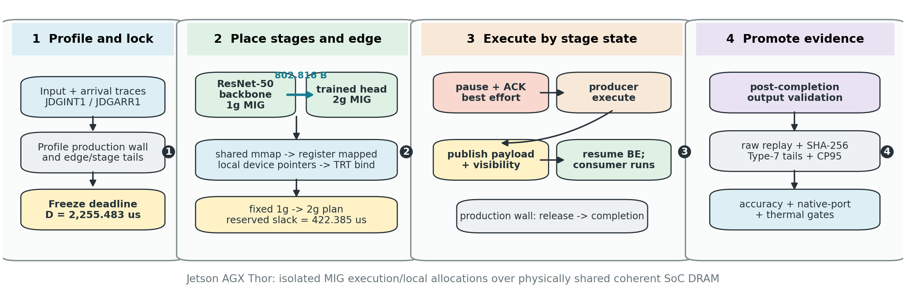
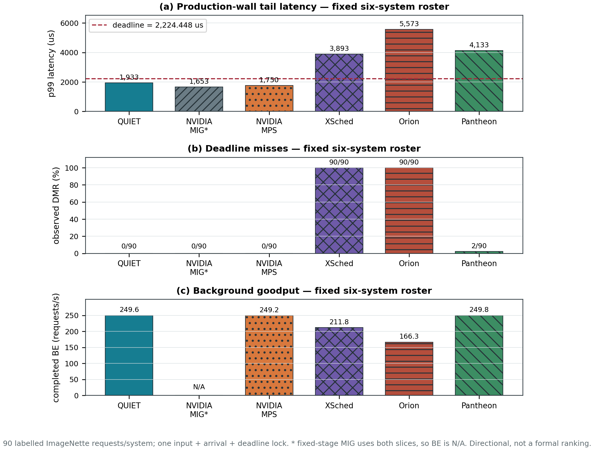
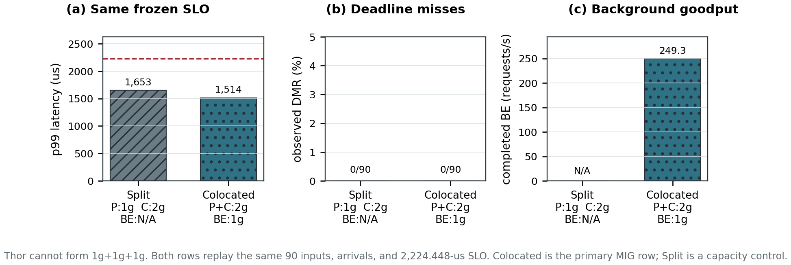
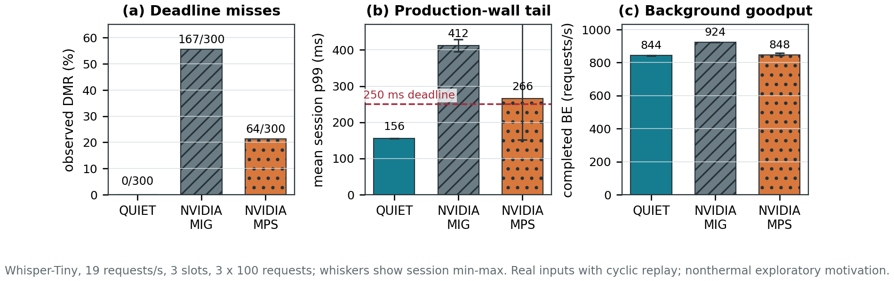
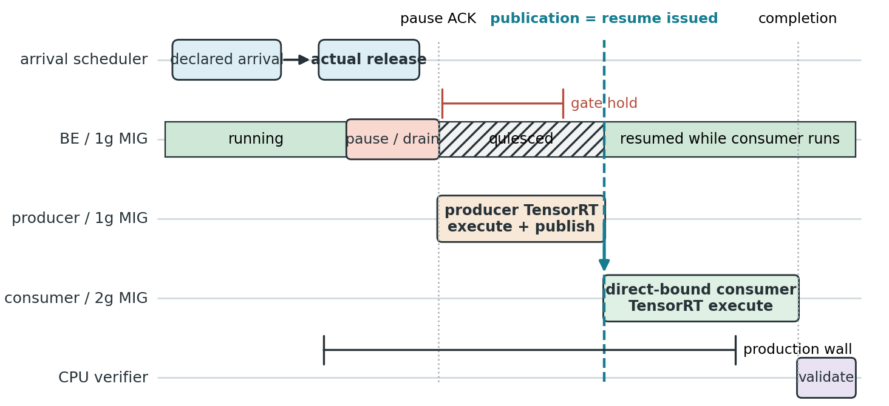

# QUIET on Jetson AGX Thor

QUIET is a dependency-aware runtime for two-stage TensorRT inference across
isolated edge-GPU partitions. It carries a complete intermediate activation
between separate Thor MIG CUDA contexts through full-coherent registered
system memory, protects the producer from best-effort interference, and
returns that capacity immediately after publication while the consumer runs.

QUIET jointly decides stage placement, activation-edge transport, protection
scope, and admission against an arrival-to-completion deadline. It does not
modify TensorRT engines, CUDA kernels, or the NVIDIA driver.

<p align="center">
  
</p>

## Why a system is not in the numeric graph

The first table is intentionally reason-only. A system is absent from the
fixed numeric roster only when its published runtime cannot execute the
locked Thor workload, its native planner rejects the dependent DAG, or its
design changes the model/runtime control boundary. A local heuristic is never
reported under a published system's name.

| System | Blocking reason for a current end-to-end numeric row |
|---|---|
| [BLESS](baselines/bless/) (EuroSys 2025) | Its scheduler, estimators, and q25 affinity-replica path execute, but the exact q100 plan fails inside TensorRT Myelin in the required 2-SM context |
| [GSLICE](baselines/gslice/) (SoCC 2020) | The historical local quota selector is not a faithful artifact execution on the current labelled TensorRT DAG |
| [gpulet](baselines/gpulet/) (USENIX ATC 2022) | The native planner evaluates all representable Thor partitions but finds no feasible dependent placement |
| [BOER](baselines/boer/) (SC 2025) | The pinned optimizer passes independent-service controls but finds no feasible point for the locked dependent DAG |
| [ParvaGPU](baselines/parvagpu/) (SC 2024) | The pinned segment allocator runs independent controls, then rejects the dependent producer at admission |
| [DeepPlan](baselines/deepplan/) (EuroSys 2023) | The artifact chooses an activation transport; it does not provide the required end-to-end dependency scheduler |
| [Mudi](https://chenwenyan.github.io/assets/pdf/mudi.pdf) (EuroSys 2025) | Cluster inference/training scaling has a different objective, and no public artifact exposes the Thor dependency interface |
| [MIGER](https://doi.org/10.1145/3673038.3673089) (ICPP 2024) | Joint cluster-level MIG+MPS allocation has no request-specific activation edge or Thor adapter |
| [FluidFaaS](https://research.csc.ncsu.edu/picture/publications/papers/hpdc2025.pdf) (HPDC 2025) | Its A100 serverless runtime was not executable on Thor; only the host-memory materialize/copy mechanism is retained as a transport control |
| [REEF](https://www.usenix.org/conference/osdi22/presentation/han) (OSDI 2022) | Its reset/preemption backend cannot control the closed TensorRT execution path |
| [Miriam](https://doi.org/10.1145/3625687.3625789) (SenSys 2023) | It requires generated elastic CUDA kernels rather than the frozen opaque TensorRT plans |
| [HaX-CoNN](https://doi.org/10.1145/3627535.3638502) (PPoPP 2024) | Per-layer heterogeneous mapping requires an accuracy-equivalent DLA path unavailable to this workload |
| [EdgeIso](https://doi.org/10.1109/IPDPS47924.2020.00039) (IPDPS 2020) | CPU/GPU shared-resource and DVFS isolation operates at a different control boundary |
| [DARIS](https://arxiv.org/abs/2504.08795) (2025 preprint) | It requires a modified segmented LibTorch path, changing the locked runtime semantics |
| [EdgeServing](https://arxiv.org/abs/2605.05527) (2026 preprint) | Batching and early exits change model execution and require a separate accuracy-equivalent adapter |
| [Ev-Edge](https://arxiv.org/abs/2403.15717) (2024 preprint) | It targets event-camera workloads and a Xavier-specific runtime rather than the Thor TensorRT dependency contract |
| [GCAPS](https://arxiv.org/abs/2406.05221) (2024 preprint) | It requires driver and task-segment instrumentation unavailable in the current stack |
| [GPreempt](https://www.usenix.org/conference/atc25/presentation/fan) (USENIX ATC 2025) | It requires runtime/kernel timeslice yields outside the unmodified TensorRT boundary |
| [Edge-GPU process isolation study](https://arxiv.org/abs/2601.07600) (2026 preprint) | It is a characterization study rather than an executable dependency scheduler |

The measured partial evidence for the first six rows is retained below; the
reason-only table does not imply that those artifacts were ignored.

## Fixed measured comparison roster

Every system-level result uses one public order and keeps it unchanged:
**QUIET → NVIDIA MIG → NVIDIA MPS → XSched → Orion → Pantheon**. The common
gate binds all six rows to the same 90 labelled ImageNette inputs, operational
arrival trace, 802,816-byte ResNet-50 activation, frozen runtime artifacts,
and 2,224.448-us deadline. Every row reaches the application accuracy gate.

| System | Requests | Misses | Observed DMR | CP95 DMR | p99 (us) | BE requests/s | Accuracy | Scope |
|---|---:|---:|---:|---:|---:|---:|---:|---|
| **QUIET** | 90 | **0** | **0.0000%** | 3.2738% | 1,933.446 | 249.600 | 0.8333 | Proposed system, common gate |
| NVIDIA MIG | 90 | **0** | **0.0000%** | 3.2738% | **1,514.253** | 249.319 | 0.8444 | Vendor isolation baseline; critical DAG on 2g and BE on isolated 1g |
| NVIDIA MPS | 90 | **0** | **0.0000%** | 3.2738% | 1,749.850 | 249.161 | 0.8333 | Vendor sharing baseline |
| [XSched](baselines/xsched/) (OSDI 2025) | 90 | 90 | 100.0000% | 100.0000% | 3,893.452 | 211.756 | 0.8333 | Pinned native XQueue runtime |
| [Orion](baselines/orion/) (EuroSys 2024) | 90 | 90 | 100.0000% | 100.0000% | 5,573.205 | 166.267 | 0.8333 | Executed Thor port; upstream differential-fidelity gate remains open |
| [Pantheon](baselines/pantheon/) (MobiSys 2024) | 90 | 2 | 2.2222% | 6.8302% | 4,133.000 | **249.785** | 0.8333 | Pinned native runtime; integer API floors the deadline to 2,224 us |

<p align="center">
  
</p>

This is a directional coverage gate, not a formal ranking. With only 90
requests, even a zero-miss row has a 3.2738% one-sided CP95 bound and cannot
certify the 0.05% DMR target. MIG is included as a complete comparator using
its valid BE-capable layout: producer and consumer share 2g while the BE
tenant runs on the isolated 1g instance. Its 249.319 requests/s is measured
goodput, not an inferred value.

The checked-in compact summary is
[`p9-six-system-imagenette-gate.json`](paper/eurosys27/generated/p9-six-system-imagenette-gate.json),
and its raw-input/output hashes are bound by
[`p9-six-system-imagenette-gate-provenance.json`](paper/eurosys27/generated/p9-six-system-imagenette-gate-provenance.json).

### MIG topology selection and capacity control

Thor cannot be divided into three simultaneous 1g MIG instances. The `3g`
capacity label describes the whole GPU, not three independently placeable 1g
slots: the local `nvidia-smi mig -lgipp` inventory exposes one 1g placement
and one 2g placement, and NVIDIA documents a maximum of two simultaneous Thor
instances in its [supported MIG profiles](https://docs.nvidia.com/datacenter/tesla/mig-user-guide/supported-mig-profiles.html).
Consequently, there are two relevant two-instance layouts:

| MIG layout | Producer | Consumer | BE tenant | Requests | Misses | p99 (us) | BE requests/s | Accuracy | Comparison scope |
|---|---|---|---|---:|---:|---:|---:|---:|---|
| Split critical stages | 1g | 2g | Not admitted | 90 | 0 | 1,652.861 | N/A | 0.8333 | Secondary no-BE capacity control |
| Colocated critical DAG | 2g | Same 2g | Isolated 1g | 90 | 0 | **1,514.253** | **249.319** | 0.8444 | **Primary six-system MIG row** |

<p align="center">
  
</p>

Both rows replay the same 90 labelled inputs, operational arrival trace, and
2,224.448-us deadline. The colocated row validates 0/90 misses and 249.319 BE
requests/s, while its FP16 producer plan changes one prediction in the
favourable direction (0.8333 to 0.8444 accuracy) and passes the configured
0.02 exploratory tolerance. TensorRT plans are MIG-profile-specific, so the
producer plan had to be rebuilt for 2g; stage placement and engine tactics
therefore differ between the two MIG controls. The BE-capable colocated row is
the MIG value repeated in the primary six-system table and all three graph
panels. It remains a one-session directional result rather than a formal
repeated-session ranking point.

### Where isolated MIG stops being enough — nonthermal ASR motivation

The ImageNette stages above are highly unbalanced, so colocating them on 2g is
the correct choice. A real Whisper-Tiny encoder–decoder pipeline exposes the
opposite regime: with three requests in flight, encoder request *i+1* can run
on 1g while decoder request *i* runs on 2g. The comparison below keeps the
same FP32 model, 2,304,000-byte activation, 19-request/s release schedule,
250-ms deadline, saturated DistilBERT BE tenant, and output oracle. Only
placement and producer protection differ. The encoder plan is rebuilt and
hash-bound for each MIG profile, as TensorRT requires; precision, model,
decoder plans, inputs, and outputs remain fixed.

| System | Placement and protection | Requests | Session misses | Observed DMR | Mean session p99 (ms) | Queue p99 (ms) | Critical requests/s | BE requests/s |
|---|---|---:|---:|---:|---:|---:|---:|---:|
| **QUIET** | P:1g with BE, C:2g; pause BE only through producer publication | 300 | **0 / 0 / 0** | **0.000%** | **155.581** | **0.903** | **18.732** | 843.645 |
| NVIDIA MIG | P+C:2g; BE isolated on 1g | 300 | 59 / 57 / 51 | 55.667% | 412.060 | 241.104 | 17.791 | **924.073** |
| NVIDIA MPS | Static P:1g with BE, C:2g; no request gate | 300 | 0 / 0 / 64 | 21.333% | 266.168 | 100.938 | 18.329 | 847.754 |

<p align="center">
  
</p>

This is the missing MIG crossover. At 19 requests/s, colocating both critical
stages on 2g leaves the critical path below the offered rate even though the
BE tenant is isolated: queue p99 grows to 241.104 ms and MIG misses 167 of 300
deadlines. Static splitting recovers pipeline parallelism but remains at the
contention boundary. QUIET's publication-scoped gate makes all three sessions
stable, reduces mean session p99 by 62.2% relative to MIG, and raises critical
goodput by 5.3%. Relative to static MPS, it reduces p99 by 41.5% while changing
BE goodput by -0.5%. All nine application output traces have the same SHA-256.

The realism boundary is explicit. NVIDIA documents Thor MIG as hardware-level
isolation for concurrent tenants, but also documents that the Thor iGPU uses
CPU-shared unified system memory and exposes only the 1g+2g geometry used
here ([Jetson MIG guide](https://docs.nvidia.com/jetson/archives/r39.2/DeveloperGuide/SD/MiG.html),
[Thor profiles](https://docs.nvidia.com/datacenter/tesla/mig-user-guide/supported-mig-profiles.html)).
Whisper itself is an encoder–decoder model over 30-second audio windows
([original paper](https://cdn.openai.com/papers/whisper.pdf)), and pipelined
streaming adaptations are demonstrated research workloads
([Whisper-Streaming](https://arxiv.org/abs/2307.14743)). Thus the dependency,
stage overlap, multi-tenant placement, and data are realistic. The exact load
is not yet a field trace: it cyclically replays 12 labelled LibriSpeech windows
and the 250-ms value is an internal inference budget, not a universal
end-user ASR SLO. The defensible scope is a multi-channel edge ASR gateway or
queued transcription service under saturation—not a single-user assistant.
This result is therefore a nonthermal motivation experiment, not a promoted
formal ranking or an accuracy-coverage expansion.

The checked-in compact evidence is
[`p9-whisper-asr-mig-crossover.json`](paper/eurosys27/generated/p9-whisper-asr-mig-crossover.json).

## Formal promotion ledger — same fixed roster

The thermal formal campaign is a separate contract: six counterbalanced
sessions, 1,100 measured requests per enrolled system per session, and a
2,255.483-us deadline. The six names remain in the same order; an unenrolled
row is marked explicitly rather than silently disappearing.

| System | Formal requests | Misses | CP95 DMR | p99 (us) | BE requests/s | Promotion status |
|---|---:|---:|---:|---:|---:|---|
| **QUIET** | 6,600 | **0** | **0.0454%** | **1,902.987** | 249.909 | **Confidence-qualified formal row** |
| NVIDIA MIG | — | — | — | — | — | Complete 90-request row measured above; independent repeated-session and thermal campaign not yet run |
| NVIDIA MPS | 6,600 | 2 | 0.0954% | 2,045.606 | **249.941** | Formal row; misses the 0.05% confidence target |
| XSched | 6,600 | 6,600 | 100.0000% | 4,351.332 | 97.845 | Formal native row; SLO-infeasible |
| Orion | — | — | — | — | — | Common gate measured above; differential fidelity, repeated-session, and thermal gates remain open |
| Pantheon | — | — | — | — | — | Common native gate measured above; repeated-session and thermal gates remain open |

QUIET is the only enrolled row whose exact confidence bound qualifies for the
frozen 0.05% target. Across the six paired sessions, QUIET reduces p99
relative to MPS by 138.508 us, with a 95% interval of [-233.217, -43.798] us.
The paired BE-goodput effect is -0.0317 requests/s with an interval of
[-0.0988, 0.0354], so the supported claim is lower tail latency at a
statistically unresolved goodput difference, not a throughput win.

All six sessions pass the frozen thermal gate. Each has 430--434 telemetry
samples and the required VDD_GPU rail; the largest within-session `soc012`
range is 3.907 °C, the largest `tj` range is 2.938 °C, and the largest
cross-session mean drift is 0.910 °C. Temperature admits or rejects a session;
it is not used to rescale latency.

## Application semantics — same fixed roster

| System | Measured inputs | Reference accuracy | Candidate accuracy | Delta | Output/input binding |
|---|---:|---:|---:|---:|---|
| **QUIET** | 90 | 0.8333 | 0.8333 | 0.0000 | Passed |
| NVIDIA MIG | 90 | 0.8333 | 0.8444 | +0.0111 | Passed |
| NVIDIA MPS | 90 | 0.8333 | 0.8333 | 0.0000 | Passed |
| XSched | 90 | 0.8333 | 0.8333 | 0.0000 | Passed |
| Orion | 90 | 0.8333 | 0.8333 | 0.0000 | Passed |
| Pantheon | 90 | 0.8333 | 0.8333 | 0.0000 | Passed |

QUIET additionally passes a real Whisper-Tiny/LibriSpeech gate on 10
utterances: reference and candidate exact-match accuracy are both 0.9000,
reference and candidate WER are both 0.1127, and the output traces are
byte-identical.

## Partial artifact evidence

These measurements explain what did execute for systems excluded by the
reason-only table. They are not mixed with the six-system ImageNette graph.

| System | Executed partial evidence | Recorded outcome |
|---|---|---|
| BLESS | Scheduler/estimators, 2/4/6/8-SM contexts, 9,400 traced launches, q25 held-out switching, and exact-q100 compatibility | q25 output/switch gate passes; exact q100 plan fails in the required 2-SM context |
| GSLICE | Historical quota-selection port on the superseded Whisper projection | 9,000/9,000 misses; p99 2,094.460 us; BE 499.955 requests/s |
| gpulet | Native planner over all five representable partitions plus a historical diagnostic execution | No feasible dependent plan; diagnostic 9,000/9,000 misses, p99 2,099.367 us, BE 499.959 requests/s |
| BOER | Pinned optimizer on independent services and the dependent DAG | Independent worst p99 1.481 ms at 499.78/499.63 requests/s; dependent best p99 2.058 ms with 100% DMR and no feasible point |
| ParvaGPU | Pinned segment allocator on independent services and the dependent DAG | Independent p99 0.434/0.969 ms at 499.89/499.76 requests/s; dependent producer rejected |
| DeepPlan | Pinned planner on the measured 2.304-MB transport profile | Dynamic plan selects direct host access: 14.058-us p99 versus 114.041 us for pinned load/copy |

The complete design-space audit is in [`docs/sota-matrix.md`](docs/sota-matrix.md),
the historical audit is in
[`docs/p9-sota-reselection.md`](docs/p9-sota-reselection.md), and the claim
boundary is in [`docs/p9-current-status.md`](docs/p9-current-status.md).

## QUIET mechanism validation

The following are factor controls, not alternative system rankings, so they
do not reuse published-system names or enter the fixed six-system graph.

### Same-activation causal replay

The independent and dependent arms use the same pre-captured activation
bytes, models, request IDs, placement, arrivals, pressure, and output oracle.
Only precedence changes. Each point is a 20-request arm; the interval uses
three sequential session pairs and remains exploratory.

| Runtime control | Mean dependent - independent p99 | 95% paired-session interval |
|---|---:|---:|
| **QUIET** | **-2,081.286 us** | **[-2,394.953, -1,767.619] us** |
| NVIDIA MPS | -514.579 us | [-4,779.753, 3,750.595] us |

### Transport control

The 20-request learned ResNet10 control carries the same 1,884,160-byte
tensor and emits the same output trace for every transport. It rejects the
assumption that registered direct binding is universally fastest.

| Transport | Edge p99 (us) | Production-wall p99 (us) |
|---|---:|---:|
| Registered coherent system memory, direct TensorRT binding | 2,195.508 | 2,908.268 |
| Pinned D2H/H2D bounce | **1,863.770** | **2,538.617** |
| Pageable bounce | 2,283.200 | 2,975.838 |

These short nonthermal measurements characterize mechanisms; they are not a
universal transport ranking.

## Runtime boundary

QUIET starts protection before producer release and ends it immediately after
payload publication/visibility. Best-effort work resumes while the consumer
runs. Production-wall latency ends at consumer completion; checksums and
output validation happen afterward.

<p align="center">
  
</p>

## Repository layout

```text
.
├── analysis/       Evidence replay, statistics, audits, and paper generation
├── baselines/      Published-system ports/adapters and fidelity checks
├── benchmarks/     C++/CUDA microbenchmarks and TensorRT pipeline binaries
├── configs/        Sanitized configuration examples
├── docs/           Platform notes, contracts, runbooks, and comparison scope
├── include/        Shared C++ headers
├── models/         Download manifest and public label/class metadata
├── paper/eurosys27 Current LaTeX source, figures, generated tables, and PDF
├── runtime/        QUIET controllers, telemetry, and aggregation logic
├── scripts/        Model preparation and experiment orchestration
├── src/            Platform probe implementation
└── tests/          Python, shell-contract, and C++ unit tests
```

Build products, virtual environments, downloaded models, TensorRT engines,
machine-local MIG state, and raw experiment directories are intentionally not
tracked. The repository stays source-oriented while the 30-GB raw corpus
remains on the measurement host; compact numeric summaries and figure hashes
are versioned.

## Build and test

The native runtime requires Jetson Linux R39.2, CUDA 13.2, TensorRT 10.16.2,
CMake 3.25 or newer, Ninja, and a C++20 compiler.

```bash
cmake -S . -B build-r39 -G Ninja \
  -DCMAKE_BUILD_TYPE=Release \
  -DCMAKE_CUDA_COMPILER=/usr/local/cuda-13.2/bin/nvcc \
  -DCMAKE_CUDA_ARCHITECTURES=110
cmake --build build-r39 --parallel
ctest --test-dir build-r39 --output-on-failure
python3 -m pytest -q
```

Project targets compile with strict host warnings, including `-Wall`,
`-Wextra`, `-Wpedantic`, and `-Werror` where applicable.

## Platform configuration

`scripts/configure_thor_mig.sh` creates the fixed 1g+2g layout and writes a
machine-local environment file. The variable schema is shown in
[`configs/mig.env.example`](configs/mig.env.example); real UUIDs are never
committed.

Thor supports at most two simultaneous MIG instances, so a three-way
producer/consumer/BE split is unavailable. The alternative measured layout
places both critical stages on 2g and BE on the isolated 1g instance:

```bash
scripts/run_p9_mig_colocated_imagenette.sh
```

Experiment runners validate MIG UUIDs, model/input hashes, operational release
traces, thermal sensors, and runtime binaries before admitting a run.
System-level scripts may stop the display manager, pin clocks, or manage a
private MPS daemon and therefore require appropriate local privileges.

## Paper and figure reproduction

The manuscript entry point is
[`paper/eurosys27/p9-main.tex`](paper/eurosys27/p9-main.tex), and the compiled
paper is [`paper/eurosys27/p9-main.pdf`](paper/eurosys27/p9-main.pdf).

```bash
python3 analysis/generate_p9_six_system_figure.py
python3 analysis/generate_p9_current_figures.py

cd paper/eurosys27
pdflatex -interaction=nonstopmode -halt-on-error p9-main.tex
bibtex p9-main
pdflatex -interaction=nonstopmode -halt-on-error p9-main.tex
pdflatex -interaction=nonstopmode -halt-on-error p9-main.tex
```

Both generators fail closed on input SHA-256, request count, deadline,
accuracy/output binding, and replayed metric mismatches.

## Evidence policy and scope

- `results/` is the local raw evidence store and is excluded from Git.
- `models/cache/` and `models/engines/` are reproducible downloads/builds and
  are excluded from Git.
- `models/manifest.json` records public sources and expected hashes.
- The two provenance manifests under `paper/eurosys27/generated/` bind every
  promoted compact summary, figure, and table to its raw evidence.
- A published-system name is used numerically only when its pinned scheduler
  or runtime executes the measured request. Local approximations retain their
  own control or diagnostic labels.

The formal claim is limited to one Jetson AGX Thor, one fixed 1g+2g placement,
one thermal envelope, and a low-inflight two-stage ImageNette path. The
validated external-process ring and larger-DAG planner schema are not yet the
production TensorRT data path, and the current result does not imply a general
multi-inflight or arbitrary-DAG performance guarantee.
