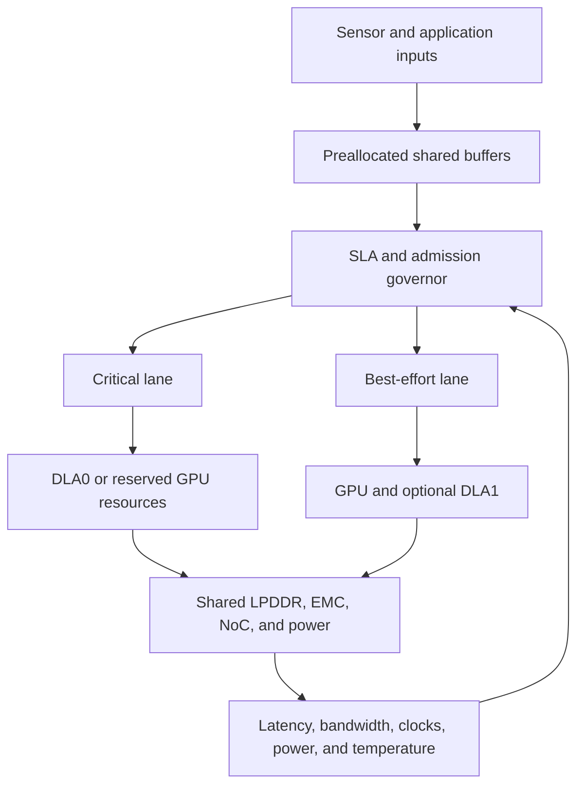

# JetsonDLAGreen

**Predictable multi-model inference on NVIDIA Jetson through joint DLA-GPU placement and shared-resource control.**

> **Project status:** Research prototype in the design and measurement stage. The performance bounds below are evaluation targets, not measured results.

## Overview

Jetson platforms increasingly run several AI models at the same time. A latency-critical perception or control model may share the SoC with segmentation, speech, vision-language, or large language models. Naive concurrency can increase tail latency and cause deadline misses even when average utilization appears safe.

JetsonDLAGreen studies how to preserve the latency of critical inference while recovering useful throughput from best-effort models. The project combines:

- heterogeneous placement across DLA and GPU;
- GPU resource control with MPS, CUDA Green Contexts, or prioritized streams when supported by the target software stack;
- deadline- and slack-aware admission control;
- shared LPDDR/EMC, power, thermal, and CPU-launch interference monitoring; and
- preallocated zero-copy data paths that remove avoidable copies without treating zero-copy as an isolation mechanism.

The central hypothesis is:

> Compute-engine separation alone is insufficient on a shared-memory Jetson SoC. Predictable mixed-critical inference requires joint control of compute placement, memory traffic, power state, and host-side dispatch.

## Why This Project?

Dedicated execution resources help, but they do not remove every source of interference.

- DLA and GPU use different execution engines, but they still share the SoC memory system, interconnect, and power budget.
- GPU spatial partitioning can restrict SM usage, but it does not provide MIG-level isolation for all shared resources.
- CUDA stream priority affects dispatch preference, but it does not guarantee immediate preemption of an already running long kernel.
- Zero-copy buffers reduce data movement, but all clients can still contend for LPDDR/EMC bandwidth.
- Host threads can introduce launch gaps, blocking, and scheduling jitter before work reaches an accelerator.

JetsonDLAGreen therefore treats inference isolation as an end-to-end systems problem rather than only a model-placement problem.

## Research Questions

1. Which resources dominate p99 latency inflation for concurrent Jetson inference: accelerator compute, LPDDR/EMC, power and thermal limits, or CPU-side launch paths?
2. When is static DLA-GPU placement sufficient, and when is runtime control required?
3. Can an online governor protect a critical model's tail latency and deadline while retaining most of the best-effort goodput?
4. How stable are the resulting policies across model mixes, request rates, power modes, and Jetson SKUs?

## System Architecture



### 1. Critical lane

For a fully DLA-compatible model, the initial design assigns the critical workload to DLA0.

- Build a DLA-only engine or loadable.
- Disable GPU fallback during isolation experiments.
- Use batch size 1 unless a deadline analysis justifies batching.
- Pre-create execution contexts and allocate all buffers before measurement.
- Pin the launch thread to a dedicated CPU core when permitted by the OS configuration.

If the model cannot run fully on DLA, the critical workload uses reserved GPU resources through CUDA Green Contexts or MPS execution-resource controls when supported. A prioritized-stream baseline is also evaluated, but priority alone is not treated as an SLA guarantee.

### 2. Best-effort lane

The best-effort lane runs throughput-oriented models on the remaining GPU resources and, when safe, on DLA1.

Candidate workloads include:

- secondary vision and segmentation models;
- Whisper-style speech models;
- vision-language models; and
- local LLM prefill and decode phases.

Long GPU work is divided at safe operator or chunk boundaries when possible. The runtime may reduce batch size, delay dispatch, or stop admitting new best-effort requests when critical slack becomes small.

### 3. Shared-resource governor

The governor observes both critical timing and system state.

- critical-request release time, deadline, and remaining slack;
- GPU and DLA utilization;
- LPDDR/EMC activity and clock state;
- GPU clocks, power mode, board power, and temperature;
- host launch gaps and CPU scheduling delay; and
- queue depth and phase information for best-effort models.

The initial policy is rule based and traceable. Model-based prediction will be added only after the interference measurements show that it materially improves decisions.

### 4. Data plane

The data path uses a fixed-size ring of preallocated buffers. Depending on the framework and producer, the implementation will evaluate NvSciBuf, NVMM/DMABUF, pinned mapped memory, and CUDA-exportable handles.

The design avoids runtime allocation, unnecessary CPU copies, JIT compilation during measurement, and Unified Memory page migration in latency-critical paths.

## From A100 Isolation to Jetson

This project is motivated by a broader isolation principle learned from co-locating latency-critical and best-effort GPU workloads. The mapping to Jetson is not one-to-one.

| Data-center concept | Jetson mechanism to evaluate | Important limitation |
|---|---|---|
| MIG compute partition | DLA-GPU engine separation or CUDA Green Contexts | LPDDR/EMC, NoC, and power remain shared |
| Cross-partition placement | Critical model on DLA0; best-effort models on GPU | DLA supports only a restricted DNN operator set |
| MPS resource control | Tegra MPS where supported | It is not full memory or fault isolation |
| Stream priority | Urgent GPU dispatch hint | It does not guarantee immediate kernel preemption |
| GPUDirect RDMA data path | NvSciBuf/NVMM/DMABUF or mapped shared buffers | Zero-copy reduces copies but does not isolate bandwidth |

## Proposed Control Loop

For each critical release, the runtime estimates whether currently admitted work can preserve the deadline.

1. Measure the critical model's isolated phase costs for the active power and clock state.
2. Estimate interference from running and queued best-effort phases.
3. Admit work only if the predicted completion time fits within the critical slack plus a safety margin.
4. If risk increases, apply the least disruptive action first:
   - reduce best-effort batching;
   - delay the next best-effort phase;
   - reduce its GPU resource quota;
   - reclaim optional DLA1 use; or
   - reject or defer new best-effort requests.
5. Record every decision and timing sample for offline validation.

## Evaluation Targets

The primary target is to limit the critical model's tail-latency inflation relative to isolated execution:

$$
p_{99,\mathrm{critical}} \leq 1.10 \times p_{99,\mathrm{standalone}}.
$$

The deadline target is:

$$
\mathrm{Deadline\ Miss\ Rate} < 1\%.
$$

At the same time, the system should recover useful best-effort throughput:

$$
\mathrm{Goodput}_{\mathrm{best\text{-}effort}} \geq
\alpha \times \mathrm{Goodput}_{\mathrm{naive\ peak}},
\qquad \alpha \in [0.70, 0.85].
$$

These bounds are initial research goals. They will be revised after the isolated and pairwise interference studies.

## Experimental Plan

### Platforms

The primary platform should be a Jetson AGX Orin or Orin NX configuration with DLA access. Orin Nano can serve as a GPU-only and power-constrained comparison platform.

Every result will record:

- Jetson SKU and memory capacity;
- JetPack, L4T, CUDA, cuDLA, and TensorRT versions;
- TensorRT engine precision and DLA compatibility report;
- `nvpmodel`, GPU/CPU/EMC clocks, fan mode, and ambient conditions;
- warm-up policy and measurement duration; and
- the exact model, input shape, batch size, and request process.

Because DLA and Green Context support depends on the installed platform software, the benchmark will run a capability probe before enabling each baseline. Unsupported mechanisms will be marked as unavailable rather than silently replaced.

### Workload classes

| Class | Representative behavior | Purpose |
|---|---|---|
| Periodic critical DNN | 30, 60, or 100 Hz; batch 1 | Tail-latency and deadline protection |
| Compute-bound model | Large GEMM/convolution phases | SM and accelerator contention |
| Memory-bound model | Large feature maps and tensor movement | LPDDR/EMC contention |
| Launch-bound model | Many short kernels | CPU and runtime dispatch overhead |
| Long best-effort model | Speech, VLM, or LLM phases | Sustained co-tenant pressure |

### Baselines

1. Critical model in isolation.
2. Naive concurrent TensorRT processes.
3. Single process with ordinary CUDA streams.
4. CUDA stream priority.
5. Tegra MPS with resource limits, when supported.
6. CUDA Green Context partitioning, when supported.
7. Static DLA-critical and GPU-best-effort placement.
8. JetsonDLAGreen joint governor.

### Metrics

- critical latency: p50, p95, p99, and maximum;
- deadline miss rate and release-to-release jitter;
- slowdown relative to isolated execution;
- aggregate best-effort throughput and completed-request goodput;
- GPU, DLA, CPU, LPDDR/EMC, and NoC activity;
- launch gaps and host-side blocking time;
- board power, energy per completed request, clocks, and temperature; and
- governor overhead and decision accuracy.

## Planned Repository Structure

```text
JetsonDLAGreen/
├── benchmarks/       # Isolated and concurrent inference drivers
├── configs/          # Platform, model, and experiment manifests
├── models/           # Model preparation and engine-build scripts
├── runtime/          # Admission, scheduling, and control policies
├── telemetry/        # Jetson, CUDA, TensorRT, and OS measurements
├── experiments/      # Reproducible experiment entry points
├── analysis/         # Parsing, statistics, tables, and figures
├── docs/             # Design notes and platform validation
└── README.md
```

Directories will be added as the corresponding components become reproducible.

## Roadmap

- [ ] **P0 — Platform validation:** pin the software stack; verify DLA-only execution, MPS, Green Contexts, clocks, and telemetry.
- [ ] **P1 — Interference atlas:** measure isolated, pairwise, and multi-tenant interference across compute-, memory-, and launch-bound workloads.
- [ ] **P2 — Static isolation:** implement DLA-GPU placement and GPU resource-partition baselines.
- [ ] **P3 — Online governor:** add slack-aware admission and phase-level throttling.
- [ ] **P4 — End-to-end case study:** evaluate a critical perception pipeline with speech, VLM, or LLM co-tenants.
- [ ] **P5 — Artifact release:** publish raw traces, scripts, statistical analysis, and paper figures.

## Scope and Non-Goals

- This project does not assume that moving a model to DLA automatically guarantees its deadline.
- DLA cannot execute arbitrary CUDA kernels, and unsupported TensorRT layers must not silently fall back to the GPU in isolation experiments.
- Zero-copy is a data-movement optimization, not a memory-bandwidth isolation mechanism.
- The first prototype targets empirical soft real-time guarantees. It is not a safety-certified hard real-time system.
- Results from one Jetson SKU or software release will not be presented as universal without cross-platform validation.

## Related Work and Documentation

JetsonDLAGreen builds on, and must be evaluated against, the following work:

- [Miriam: Exploiting Elastic Kernels for Real-time Multi-DNN Inference on Edge GPU](https://arxiv.org/abs/2307.04339) — elastic kernels and runtime coordination for mixed-critical DNN inference.
- [HaX-CoNN: Shared Memory-contention-aware Concurrent DNN Execution for Diversely Heterogeneous System-on-Chips](https://arxiv.org/abs/2308.05869) — GPU-DLA mapping with shared-memory contention and transition costs.
- [Pantheon: Preemptible Multi-DNN Inference on Mobile Edge GPUs](https://dl.acm.org/doi/10.1145/3643832.3661878) — fine-grained software preemption using stream priorities and DNN structure.
- [MapFormer: Attention-based Multi-DNN Manager for Throughput and Power Co-optimization](https://dl.acm.org/doi/10.1145/3676536.3676724) — CPU, GPU, and DLA mapping with power-aware optimization.
- [CUDA for Tegra](https://docs.nvidia.com/cuda/cuda-for-tegra-appnote/index.html) — Tegra memory behavior and MPS availability and limitations.
- [CUDA Green Contexts](https://docs.nvidia.com/cuda/cuda-programming-guide/04-special-topics/green-contexts.html) — spatial control of GPU SMs and work queues.
- [NVIDIA TensorRT DLA documentation](https://docs.nvidia.com/deeplearning/tensorrt/latest/inference-library/work-with-dla.html) — DLA build, compatibility, fallback, and runtime constraints.

## Contributing

The project is in its initial research phase. Issues that report Jetson software-stack compatibility, reproducibility problems, or additional interference cases are welcome. Please include the device SKU, JetPack/L4T version, CUDA and TensorRT versions, power mode, clock policy, and a minimal reproduction command.

## License and Citation

A license and citation entry will be added before the first code and artifact release.
